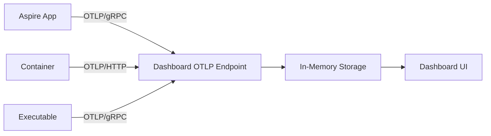

The Aspire Dashboard is a browser-based application that provides real-time observability into your distributed applications during development and debugging. It displays resource status, live logs, and comprehensive telemetry data.

## Overview

The dashboard automatically launches when you run your Aspire application and provides:

- **Resource Management**: View all resources (projects, containers, executables) in your application
- **Live Console Logs**: Real-time log streaming from all resources
- **Structured Logs**: Query and filter OpenTelemetry logs with rich metadata
- **Distributed Tracing**: Visualize request flows across services
- **Metrics**: Monitor performance counters and custom metrics

## Dashboard Views

### Resources Page

The Resources page shows all resources defined in your AppHost:

```csharp
var builder = DistributedApplication.CreateBuilder(args);

var postgres = builder.AddPostgres("postgres")
                      .WithPgAdmin();
                      
var catalogDb = postgres.AddDatabase("catalogdb");

var catalogService = builder.AddProject<Projects.CatalogService>("catalogservice")
                            .WithReference(catalogDb);
```

For each resource, the dashboard displays:

| Column | Description |
|--------|-------------|
| **Name** | Resource identifier |
| **Type** | Resource type (Project, Container, Executable) |
| **State** | Current lifecycle state |
| **Endpoints** | Network endpoints and URLs |
| **Environment** | Environment variables |
| **Logs** | Link to console output |

### Resource States

Resources progress through these states:

| State | Color | Meaning |
|-------|-------|----------|
| Starting | Yellow | Resource is launching |
| Running | Green | Successfully started and healthy |
| Waiting | Blue | Blocked on dependencies |
| Exited | Gray | Completed execution |
| FailedToStart | Red | Startup failed |
| RuntimeUnhealthy | Red | Container runtime unavailable |

### Console Logs

Click any resource to view its live console output:

```bash
info: CatalogService.CatalogApi[0]
      Starting catalog service...
info: Microsoft.Hosting.Lifetime[14]
      Now listening on: http://localhost:5000
info: Microsoft.Hosting.Lifetime[0]
      Application started. Press Ctrl+C to shut down.
```

Features:
- Real-time log streaming
- Search and filter
- Auto-scroll toggle
- Download logs
- Configurable retention (default: 10,000 messages per resource)

### Structured Logs View

The Structured Logs page displays OpenTelemetry logs with rich filtering:

```csharp
logger.LogInformation("Processing order {OrderId} for customer {CustomerId}", 
                      order.Id, customer.Id);
```

Query capabilities:
- Filter by resource name
- Filter by log level (Trace, Debug, Info, Warning, Error, Critical)
- Search message text and structured properties
- Filter by time range
- View exception details and stack traces

### Traces View

Distributed tracing shows request flows across services:

```csharp
// Automatically instrumented by Aspire service defaults
public async Task<CatalogItem> GetItemAsync(int id)
{
    // Activity automatically created and traced
    var item = await dbContext.CatalogItems.FindAsync(id);
    return item;
}
```

Trace features:
- Waterfall visualization of spans
- Service-to-service dependency graph
- Duration and timing information
- Error highlighting
- Detailed span attributes and events

### Metrics View

Monitor application performance metrics:

**Built-in ASP.NET Core metrics**:
- `http.server.request.duration` - Request latency
- `http.server.active_requests` - Concurrent requests
- `kestrel.active_connections` - Active connections

**Runtime metrics**:
- `process.runtime.dotnet.gc.collections.count` - Garbage collections
- `process.runtime.dotnet.gc.heap.size` - Heap size
- `process.runtime.dotnet.monitor.lock_contention.count` - Lock contention

**Custom application metrics**:

```csharp
var meter = new Meter("CatalogService");
var ordersProcessed = meter.CreateCounter<long>("orders.processed");

public async Task ProcessOrderAsync(Order order)
{
    await SaveOrderAsync(order);
    ordersProcessed.Add(1, new KeyValuePair<string, object?>("customer_type", order.CustomerType));
}
```

Metrics features:
- Multiple chart types (line, bar, histogram)
- Dimension filtering and grouping
- Percentile calculations
- Configurable time ranges
- Export data

## Configuration

The dashboard is configured via environment variables:

### Common Configuration

```bash
# Frontend endpoint (browser access)
ASPNETCORE_URLS=http://localhost:18888

# OTLP/gRPC endpoint (telemetry ingestion)
DOTNET_DASHBOARD_OTLP_ENDPOINT_URL=http://localhost:18889

# OTLP/HTTP endpoint
DOTNET_DASHBOARD_OTLP_HTTP_ENDPOINT_URL=http://localhost:18890

# Disable authentication for local development
DOTNET_DASHBOARD_UNSECURED_ALLOW_ANONYMOUS=true
```

### Using Configuration Files

Create a JSON configuration file:

```json dashboard.json
{
  "Dashboard": {
    "TelemetryLimits": {
      "MaxLogCount": 50000,
      "MaxTraceCount": 10000,
      "MaxMetricsCount": 100000,
      "MaxAttributeCount": 128,
      "MaxAttributeLength": 4096
    },
    "Frontend": {
      "MaxConsoleLogCount": 50000
    }
  }
}
```

Reference the file:

```bash
DOTNET_DASHBOARD_CONFIG_FILE_PATH=/path/to/dashboard.json
```

### Telemetry Limits

Control memory usage by configuring retention limits:

| Setting | Default | Purpose |
|---------|---------|----------|
| `MaxLogCount` | 10,000 | Structured logs per resource |
| `MaxTraceCount` | 10,000 | Traces per resource |
| `MaxMetricsCount` | 50,000 | Metric data points per resource |
| `MaxAttributeCount` | 128 | Attributes per telemetry item |
| `MaxAttributeLength` | Unlimited | Maximum attribute value length |
| `MaxSpanEventCount` | Unlimited | Events per span |

When limits are reached, oldest data is removed to make room for new telemetry.

## Authentication

### Local Development (Unsecured)

For local development, disable authentication:

```bash
DOTNET_DASHBOARD_UNSECURED_ALLOW_ANONYMOUS=true
```

<Warning>
  Unsecured mode should **only** be used during local development. Never expose an unsecured dashboard publicly.
</Warning>

### Browser Token Authentication

Secure the dashboard with a token:

```bash
Dashboard__Frontend__AuthMode=BrowserToken
Dashboard__Frontend__BrowserToken=your-secure-token-here
```

Access the dashboard:
```
https://localhost:18888/login?t=your-secure-token-here
```

Best practices:
- Generate a new random token each time the dashboard starts
- Don't hardcode tokens in configuration files
- Tokens are validated before granting access

### OpenID Connect (OIDC)

For production scenarios, use OIDC authentication:

```bash
Dashboard__Frontend__AuthMode=OpenIdConnect
Authentication__Schemes__OpenIdConnect__Authority=https://your-idp.com
Authentication__Schemes__OpenIdConnect__ClientId=aspire-dashboard
Authentication__Schemes__OpenIdConnect__ClientSecret=your-client-secret
```

Optional claims configuration:
```bash
Dashboard__Frontend__OpenIdConnect__NameClaimType=name
Dashboard__Frontend__OpenIdConnect__UsernameClaimType=preferred_username
Dashboard__Frontend__OpenIdConnect__RequiredClaimType=role
Dashboard__Frontend__OpenIdConnect__RequiredClaimValue=aspire-users
```

## OTLP Endpoint Security

Secure telemetry ingestion endpoints:

### API Key Authentication

```bash
Dashboard__Otlp__AuthMode=ApiKey
Dashboard__Otlp__PrimaryApiKey=primary-key-here
Dashboard__Otlp__SecondaryApiKey=secondary-key-here  # Optional for key rotation
```

### Client Certificate Authentication

```bash
Dashboard__Otlp__AuthMode=Certificate
```

Applications must present valid client certificates when sending telemetry.

## Resource Service Client

The dashboard connects to the Aspire resource service to retrieve resource information:

```bash
# Resource service endpoint
Dashboard__ResourceServiceClient__Url=https://localhost:17000

# API key authentication
Dashboard__ResourceServiceClient__AuthMode=ApiKey
Dashboard__ResourceServiceClient__ApiKey=resource-service-key
```

If `ResourceServiceClient:Url` is not configured, the dashboard shows telemetry data but no resource list or console logs.

## Telemetry Architecture

Aspire applications send telemetry to the dashboard using the OpenTelemetry Protocol (OTLP):



Applications are automatically configured with:

```bash
# Service identification
OTEL_SERVICE_NAME=catalogservice
OTEL_RESOURCE_ATTRIBUTES=service.instance.id=1a5f9c1e-e5ba-451b

# Export endpoint
OTEL_EXPORTER_OTLP_ENDPOINT=http://localhost:4318

# Fast export intervals for development
OTEL_BSP_SCHEDULE_DELAY=1000
OTEL_BLRP_SCHEDULE_DELAY=1000
OTEL_METRIC_EXPORT_INTERVAL=1000
```

## Dashboard URLs and Navigation

Customize dashboard URLs for resources:

```csharp
var catalogService = builder.AddProject<Projects.CatalogService>("catalogservice")
    // Modify the default HTTPS endpoint URL
    .WithUrlForEndpoint("https", u =>
    {
        u.Url = "/";
        u.DisplayText = "Catalog API";
    })
    // Add a custom URL
    .WithUrlForEndpoint("https", _ => new()
    {
        Url = "/swagger",
        DisplayText = "Swagger UI"
    })
    // Hide HTTP URL from main view
    .WithUrlForEndpoint("http", u => u.DisplayLocation = UrlDisplayLocation.DetailsOnly);
```

Display locations:
- `UrlDisplayLocation.ResourceTable` - Show in main resources table (default)
- `UrlDisplayLocation.DetailsOnly` - Show only in resource details panel

## Memory Management

The dashboard stores all telemetry in memory:

- Limits prevent excessive memory usage
- Oldest data is removed when limits are reached
- Limits apply per-resource (not global)
- Console logs and structured logs have separate limits

### Monitoring Dashboard Memory

The dashboard itself emits metrics:

```bash
# Dashboard process metrics
process.runtime.dotnet.gc.heap.size
process.runtime.dotnet.gc.collections.count
```

Monitor these metrics if you experience memory issues.

## Data Collection and Privacy

The Aspire Dashboard may collect usage telemetry and send it to Microsoft.

### Opt Out of Telemetry

Disable dashboard telemetry:

```bash
ASPIRE_DASHBOARD_TELEMETRY_OPTOUT=true
```

Or disable in your IDE:
- **Visual Studio**: Tools > Options > Environment > Aspire Dashboard
- **VS Code**: Settings > Extensions > Aspire Dashboard

For more information, see the [Microsoft privacy statement](https://go.microsoft.com/fwlink/?LinkId=521839).

## Troubleshooting

<AccordionGroup>
  <Accordion title="Dashboard not launching">
    Check that port 18888 is available. Configure a different port:
    ```bash
    ASPNETCORE_URLS=http://localhost:19000
    ```
  </Accordion>
  
  <Accordion title="No telemetry data appearing">
    Verify that:
    1. Services call `builder.AddServiceDefaults()`
    2. `OTEL_EXPORTER_OTLP_ENDPOINT` is configured correctly
    3. OTLP endpoint authentication is properly configured
  </Accordion>
  
  <Accordion title="Missing resource information">
    Ensure `Dashboard:ResourceServiceClient:Url` is configured to point to the Aspire resource service.
  </Accordion>
  
  <Accordion title="Console logs truncated">
    Increase the retention limit:
    ```bash
    Dashboard__Frontend__MaxConsoleLogCount=50000
    ```
  </Accordion>
</AccordionGroup>

## Next Steps

<CardGroup cols={2}>
  <Card title="Telemetry" icon="chart-mixed" href="/concepts/telemetry">
    Learn about structured logging, tracing, and metrics
  </Card>
  <Card title="Application Model" icon="diagram-project" href="/concepts/app-model">
    Understand resources and the app model
  </Card>
  <Card title="Service Discovery" icon="compass" href="/concepts/service-discovery">
    Configure service-to-service communication
  </Card>
  <Card title="Deployment" icon="cloud" href="/deployment/overview">
    Deploy applications to production
  </Card>
</CardGroup>