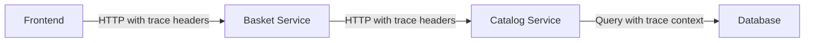
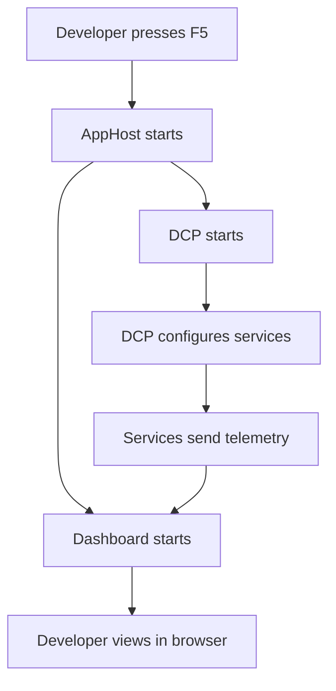

.NET Aspire applications are built with observability as a core principle. By default, Aspire configures comprehensive telemetry collection and export using OpenTelemetry, making your distributed applications easy to debug and diagnose.

## Overview

Aspire provides three types of telemetry out of the box:

- **Structured Logging**: Rich log entries with structured data from `ILogger`
- **Distributed Tracing**: Request flows across services using `Activity`
- **Metrics**: Numeric performance counters from `Meter` and `Instrument<T>`

All telemetry is collected using the [OpenTelemetry](https://opentelemetry.io/) standard and exported via the OpenTelemetry Protocol (OTLP).

## OpenTelemetry SDK

The [.NET OpenTelemetry SDK](https://github.com/open-telemetry/opentelemetry-dotnet) provides:

- Collection from standard .NET APIs (`ILogger`, `Activity`, `Meter`)
- Automatic instrumentation for ASP.NET Core, HttpClient, and runtime
- OTLP export over gRPC or HTTP
- Extensible pipeline for processing and enriching telemetry

## Service Defaults Configuration

Aspire project templates include a **ServiceDefaults** project that configures OpenTelemetry automatically:

```csharp Extensions.cs (ServiceDefaults project)
public static TBuilder ConfigureOpenTelemetry<TBuilder>(this TBuilder builder) 
    where TBuilder : IHostApplicationBuilder
{
    // Configure logging
    builder.Logging.AddOpenTelemetry(logging =>
    {
        logging.IncludeFormattedMessage = true;
        logging.IncludeScopes = true;
    });

    // Configure metrics and tracing
    builder.Services.AddOpenTelemetry()
        .WithMetrics(metrics =>
        {
            metrics.AddAspNetCoreInstrumentation()
                   .AddHttpClientInstrumentation()
                   .AddRuntimeInstrumentation()
                   .SetExemplarFilter(ExemplarFilterType.TraceBased);
        })
        .WithTracing(tracing =>
        {
            tracing.AddAspNetCoreInstrumentation(tracing =>
                   tracing.Filter = context =>
                       !context.Request.Path.StartsWithSegments("/health")
                   )
                   .AddGrpcClientInstrumentation()
                   .AddHttpClientInstrumentation();
        });

    builder.AddOpenTelemetryExporters();

    return builder;
}

private static TBuilder AddOpenTelemetryExporters<TBuilder>(this TBuilder builder) 
    where TBuilder : IHostApplicationBuilder
{
    var useOtlpExporter = !string.IsNullOrWhiteSpace(
        builder.Configuration["OTEL_EXPORTER_OTLP_ENDPOINT"]);

    if (useOtlpExporter)
    {
        builder.Services.AddOpenTelemetry().UseOtlpExporter();
    }

    return builder;
}
```

Every service project should call `AddServiceDefaults()` at startup:

```csharp Program.cs
var builder = WebApplication.CreateBuilder(args);
builder.AddServiceDefaults();  // Configures OpenTelemetry

var app = builder.Build();
app.MapDefaultEndpoints();  // Adds /health endpoints
app.Run();
```

## Environment Variables

Aspire automatically configures OpenTelemetry using [standard environment variables](https://opentelemetry.io/docs/specs/otel/configuration/sdk-environment-variables/):

### Service Identification

```bash
# Service name (matches AppHost resource name)
OTEL_SERVICE_NAME=catalogservice

# Unique instance identifier
OTEL_RESOURCE_ATTRIBUTES=service.instance.id=1a5f9c1e-e5ba-451b-95ee-ced1ee89c168
```

### Export Configuration

```bash
# OTLP endpoint (dashboard in local dev)
OTEL_EXPORTER_OTLP_ENDPOINT=http://localhost:4318

# Export intervals (fast for local development)
OTEL_BSP_SCHEDULE_DELAY=1000           # Batch span processor (traces)
OTEL_BLRP_SCHEDULE_DELAY=1000          # Batch log record processor
OTEL_METRIC_EXPORT_INTERVAL=1000       # Metrics export interval
```

These variables are set automatically when running locally. In deployment, configure `OTEL_EXPORTER_OTLP_ENDPOINT` to point to your monitoring infrastructure.

## Structured Logging

Aspire captures all `ILogger` output as structured OpenTelemetry logs:

```csharp
public class CatalogApi
{
    private readonly ILogger<CatalogApi> _logger;

    public CatalogApi(ILogger<CatalogApi> logger)
    {
        _logger = logger;
    }

    public async Task<CatalogItem> GetItemAsync(int id)
    {
        _logger.LogInformation(
            "Fetching catalog item {ItemId} at {Timestamp}",
            id,
            DateTimeOffset.UtcNow);

        try
        {
            var item = await GetItemFromDatabaseAsync(id);
            return item;
        }
        catch (Exception ex)
        {
            _logger.LogError(ex, 
                "Failed to fetch catalog item {ItemId}", 
                id);
            throw;
        }
    }
}
```

### Log Levels

Use appropriate log levels:

| Level | When to Use | Example |
|-------|-------------|----------|
| `Trace` | Very detailed diagnostic info | "Entering method X with parameters Y" |
| `Debug` | Debugging information | "Cache hit for key 'abc'" |
| `Information` | General flow of the application | "Processing order {OrderId}" |
| `Warning` | Unexpected but handled situations | "Retry attempt 2 of 3" |
| `Error` | Errors and exceptions | "Database query failed" |
| `Critical` | Critical failures | "Service cannot start" |

### Structured Properties

Always use structured logging instead of string interpolation:

```csharp
// ❌ Bad - string interpolation loses structure
_logger.LogInformation($"Processing order {order.Id} for customer {customer.Id}");

// ✅ Good - structured properties
_logger.LogInformation(
    "Processing order {OrderId} for customer {CustomerId}",
    order.Id,
    customer.Id);
```

Structured properties enable powerful querying in the dashboard and monitoring systems.

### Log Scopes

Add context to related log entries:

```csharp
using (_logger.BeginScope(new Dictionary<string, object>
{
    ["OrderId"] = order.Id,
    ["CustomerId"] = order.CustomerId
}))
{
    _logger.LogInformation("Starting order processing");
    await ProcessPaymentAsync(order);
    _logger.LogInformation("Processing complete");
}
```

All logs within the scope automatically include the scope properties.

## Distributed Tracing

Aspire automatically instruments HTTP calls, gRPC calls, and ASP.NET Core requests using `Activity` (the .NET implementation of OpenTelemetry spans).

### Automatic Instrumentation

No code changes required for basic tracing:

```csharp
public class BasketServiceClient
{
    private readonly HttpClient _httpClient;

    public BasketServiceClient(HttpClient httpClient)
    {
        _httpClient = httpClient;
    }

    // Automatically traced by HttpClient instrumentation
    public async Task<CustomerBasket> GetBasketAsync(string customerId)
    {
        var response = await _httpClient.GetAsync($"/api/basket/{customerId}");
        response.EnsureSuccessStatusCode();
        return await response.Content.ReadFromJsonAsync<CustomerBasket>();
    }
}
```

The trace includes:
- HTTP method and URL
- Request and response headers
- Status code
- Duration
- Errors and exceptions

### Custom Spans

Add custom instrumentation for important operations:

```csharp
using System.Diagnostics;

public class OrderProcessor
{
    private static readonly ActivitySource ActivitySource = new("OrderProcessing");

    public async Task ProcessOrderAsync(Order order)
    {
        // Create a custom span
        using var activity = ActivitySource.StartActivity("ProcessOrder");
        activity?.SetTag("order.id", order.Id);
        activity?.SetTag("order.total", order.Total);

        try
        {
            await ValidateOrderAsync(order);
            await ChargePaymentAsync(order);
            await FulfillOrderAsync(order);
            
            activity?.SetStatus(ActivityStatusCode.Ok);
        }
        catch (Exception ex)
        {
            activity?.SetStatus(ActivityStatusCode.Error, ex.Message);
            activity?.RecordException(ex);
            throw;
        }
    }
}
```

Register the `ActivitySource` in service defaults:

```csharp
builder.Services.AddOpenTelemetry()
    .WithTracing(tracing =>
    {
        tracing.AddSource("OrderProcessing");
    });
```

### Span Events

Add timestamped events to spans:

```csharp
using var activity = ActivitySource.StartActivity("ProcessPayment");
activity?.AddEvent(new ActivityEvent("PaymentAuthorized"));
await CapturePaymentAsync(payment);
activity?.AddEvent(new ActivityEvent("PaymentCaptured"));
```

### Trace Context Propagation

Trace context is automatically propagated across HTTP calls:



All spans are correlated into a single distributed trace visible in the dashboard.

## Metrics

Aspire collects metrics from ASP.NET Core, HttpClient, and the .NET runtime automatically.

### Built-in Metrics

**ASP.NET Core**:
- `http.server.request.duration` - Request duration histogram
- `http.server.active_requests` - Concurrent requests
- `aspnetcore.routing.match_attempts` - Route matching attempts

**HttpClient**:
- `http.client.request.duration` - Outbound request duration
- `http.client.active_requests` - Active outbound requests

**.NET Runtime**:
- `process.runtime.dotnet.gc.collections.count` - GC collections by generation
- `process.runtime.dotnet.gc.heap.size` - Heap size by generation
- `process.runtime.dotnet.monitor.lock_contention.count` - Lock contention
- `process.runtime.dotnet.thread_pool.threads.count` - Thread pool threads
- `process.runtime.dotnet.assemblies.count` - Loaded assemblies

### Custom Metrics

Create application-specific metrics:

```csharp
using System.Diagnostics.Metrics;

public class OrderMetrics
{
    private static readonly Meter Meter = new("OrderService", "1.0.0");
    
    private static readonly Counter<long> OrdersProcessed = 
        Meter.CreateCounter<long>(
            "orders.processed",
            description: "Number of orders processed");
    
    private static readonly Histogram<double> OrderValue = 
        Meter.CreateHistogram<double>(
            "orders.value",
            unit: "USD",
            description: "Order value distribution");
    
    private static readonly ObservableGauge<int> PendingOrders = 
        Meter.CreateObservableGauge<int>(
            "orders.pending",
            () => GetPendingOrderCount(),
            description: "Current number of pending orders");

    public void RecordOrderProcessed(Order order)
    {
        OrdersProcessed.Add(1, 
            new KeyValuePair<string, object?>("customer_type", order.CustomerType),
            new KeyValuePair<string, object?>("region", order.Region));
        
        OrderValue.Record(order.Total,
            new KeyValuePair<string, object?>("region", order.Region));
    }
    
    private static int GetPendingOrderCount()
    {
        // Return current pending count
        return Database.PendingOrders.Count();
    }
}
```

Register custom meters:

```csharp
builder.Services.AddOpenTelemetry()
    .WithMetrics(metrics =>
    {
        metrics.AddMeter("OrderService");
    });
```

### Metric Types

| Type | Purpose | Example |
|------|---------|----------|
| `Counter` | Ever-increasing count | Requests processed, errors |
| `Histogram` | Distribution of values | Request duration, order value |
| `ObservableGauge` | Current value at observation time | Queue length, memory usage |
| `ObservableCounter` | Counter observed at export | Total bytes allocated |

## Local Development Workflow

When you run your Aspire application locally:

1. AppHost starts the dashboard and Developer Control Plane (DCP)
2. DCP configures environment variables for each service:
   - `OTEL_SERVICE_NAME` - Resource name from AppHost
   - `OTEL_RESOURCE_ATTRIBUTES` - Unique instance ID
   - `OTEL_EXPORTER_OTLP_ENDPOINT` - Dashboard OTLP endpoint
   - Fast export intervals for responsive dashboard
3. Services call `AddServiceDefaults()` and configure OpenTelemetry SDK
4. Telemetry flows to dashboard via OTLP
5. Dashboard stores telemetry in memory and displays in UI



## Deployment Telemetry

In deployed environments, configure `OTEL_EXPORTER_OTLP_ENDPOINT` to point to your observability backend:

### Azure Monitor

```csharp
builder.Services.AddOpenTelemetry()
    .UseAzureMonitor();
```

Set `APPLICATIONINSIGHTS_CONNECTION_STRING` environment variable.

### Prometheus + Grafana

```csharp
builder.Services.AddOpenTelemetry()
    .WithMetrics(metrics => metrics.AddPrometheusExporter());

app.MapPrometheusScrapingEndpoint();
```

### Jaeger

```bash
OTEL_EXPORTER_OTLP_ENDPOINT=http://jaeger:4318
```

### Datadog, New Relic, Honeycomb, etc.

All OTLP-compatible backends work with Aspire. Configure the endpoint and any required authentication headers.

## Health Checks and Telemetry

Aspire automatically excludes health check endpoints from tracing to reduce noise:

```csharp
builder.Services.AddOpenTelemetry()
    .WithTracing(tracing =>
    {
        tracing.AddAspNetCoreInstrumentation(options =>
            options.Filter = context =>
                !context.Request.Path.StartsWithSegments("/health") &&
                !context.Request.Path.StartsWithSegments("/alive")
        );
    });
```

## Non-.NET Applications

OpenTelemetry is language-agnostic. Configure containers and executables with OTLP environment variables:

```csharp
var dapr = builder.AddContainer("dapr", "daprio/daprd")
    .WithEnvironment("OTEL_EXPORTER_OTLP_ENDPOINT", "http://localhost:4318")
    .WithEnvironment("OTEL_SERVICE_NAME", "dapr-sidecar");
```

The Dapr sidecar (written in Go) will export telemetry to the Aspire dashboard.

## Best Practices

<AccordionGroup>
  <Accordion title="Always use structured logging">
    Use template parameters, not string interpolation, to preserve structure:
    ```csharp
    _logger.LogInformation("User {UserId} logged in", userId);
    ```
  </Accordion>
  
  <Accordion title="Add custom spans for business operations">
    Trace important operations beyond HTTP calls:
    ```csharp
    using var activity = ActivitySource.StartActivity("ProcessPayment");
    activity?.SetTag("payment.method", paymentMethod);
    ```
  </Accordion>
  
  <Accordion title="Use appropriate log levels">
    Don't over-log at `Information` level. Use `Debug` and `Trace` for detailed diagnostics.
  </Accordion>
  
  <Accordion title="Add dimensions to metrics">
    Include relevant tags for filtering and grouping:
    ```csharp
    counter.Add(1, new("region", order.Region), new("type", order.Type));
    ```
  </Accordion>
  
  <Accordion title="Filter health check traces">
    Exclude health check endpoints from tracing to reduce noise (done by default in ServiceDefaults).
  </Accordion>
</AccordionGroup>

## Troubleshooting

<AccordionGroup>
  <Accordion title="No telemetry in dashboard">
    Verify:
    1. Service calls `builder.AddServiceDefaults()`
    2. `OTEL_EXPORTER_OTLP_ENDPOINT` is set
    3. Dashboard OTLP endpoint is accessible
  </Accordion>
  
  <Accordion title="Custom metrics not appearing">
    Ensure the meter is registered:
    ```csharp
    builder.Services.AddOpenTelemetry()
        .WithMetrics(metrics => metrics.AddMeter("YourMeterName"));
    ```
  </Accordion>
  
  <Accordion title="Traces not correlated across services">
    Check that all services use HttpClient from DI (automatic context propagation) and have OpenTelemetry configured.
  </Accordion>
  
  <Accordion title="Too much log data">
    Adjust log levels in appsettings.json:
    ```json
    {
      "Logging": {
        "LogLevel": {
          "Default": "Information",
          "Microsoft.AspNetCore": "Warning"
        }
      }
    }
    ```
  </Accordion>
</AccordionGroup>

## Next Steps

<CardGroup cols={2}>
  <Card title="Dashboard" icon="chart-line" href="/concepts/dashboard">
    Explore telemetry in the Aspire Dashboard
  </Card>
  <Card title="Service Discovery" icon="compass" href="/concepts/service-discovery">
    Configure service-to-service communication
  </Card>
  <Card title="Application Model" icon="diagram-project" href="/concepts/app-model">
    Understand resources and the app model
  </Card>
  <Card title="Deployment" icon="cloud" href="/deployment/overview">
    Deploy applications with telemetry to production
  </Card>
</CardGroup>