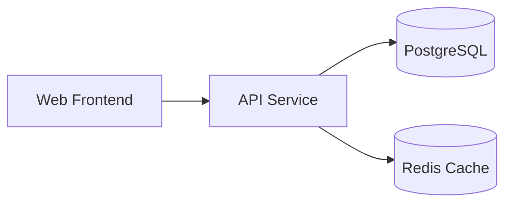

.NET Aspire is a cloud-ready framework for building observable, production-ready distributed applications with .NET. It provides tools, templates, and packages that help you build, run, and deploy distributed apps faster and with less complexity.

## What Problems Does Aspire Solve?

Building distributed applications is hard. You need to:

- Orchestrate multiple services during development
- Configure service discovery and communication
- Set up telemetry, logging, and monitoring
- Manage dependencies between services
- Deploy to cloud platforms

Aspire simplifies all of this by providing a unified, code-first approach to defining and managing your distributed application.

## Key Features

<CardGroup cols={2}>
  <Card title="Code-First App Model" icon="code">
    Define your entire application - services, resources, and connections - in a single C# program. No YAML, no configuration sprawl.
  </Card>
  
  <Card title="Built-in Orchestration" icon="sitemap">
    Launch and debug your entire distributed app locally with one command. Aspire handles port allocation, environment variables, and startup order.
  </Card>
  
  <Card title="Observable by Default" icon="chart-line">
    Get structured logging, distributed tracing, and metrics out of the box with the built-in dashboard. No additional setup required.
  </Card>
  
  <Card title="40+ Integrations" icon="puzzle-piece">
    Ready-to-use packages for databases (PostgreSQL, SQL Server, Redis, MongoDB), message queues (RabbitMQ, Kafka), and cloud services (Azure).
  </Card>
  
  <Card title="Multi-Language Support" icon="globe">
    Build polyglot applications with support for C#, Python, TypeScript, Go, Java, and Rust - all managed from a single app model.
  </Card>
  
  <Card title="Deploy Anywhere" icon="rocket">
    Deploy to Kubernetes, Azure Container Apps, or any cloud platform using the same composition you use for local development.
  </Card>
</CardGroup>

## How Aspire Works

At the center of Aspire is the **app model** - a code-first, single source of truth that defines your application's services, resources, and connections.

<Steps>
  <Step title="Define Your App">
    Create an AppHost project that declares all your services and resources using a fluent API:
    
    ```csharp Program.cs
    var builder = DistributedApplication.CreateBuilder(args);

    var cache = builder.AddRedis("cache");
    var db = builder.AddPostgres("pg").AddDatabase("db");
    
    var api = builder.AddProject<Projects.ApiService>("api")
        .WithReference(db)
        .WithReference(cache);
    
    var web = builder.AddProject<Projects.Web>("web")
        .WithExternalHttpEndpoints()
        .WithReference(api);
    
    builder.Build().Run();
    ```
  </Step>
  
  <Step title="Run and Debug">
    Launch your entire application with a single command:
    
    ```bash
    aspire run
    ```
    
    Or press F5 in Visual Studio or VS Code. Aspire automatically:
    - Starts all services in the correct order
    - Allocates ports and sets up service discovery
    - Injects connection strings and configuration
    - Launches the dashboard for monitoring
  </Step>
  
  <Step title="Monitor with the Dashboard">
    The Aspire Dashboard gives you real-time insights into your running application:
    - View all resources and their health status
    - Browse structured logs across all services
    - Explore distributed traces to understand request flows
    - Monitor metrics and performance counters
  </Step>
  
  <Step title="Deploy to Production">
    Deploy your application using the same model:
    
    ```bash
    aspire deploy
    ```
    
    Aspire generates deployment manifests for Kubernetes, Azure Container Apps, or other platforms.
  </Step>
</Steps>

## The Aspire App Model

The app model is a **graph of resources** - services, infrastructure elements, and supporting components - defined using strongly-typed, extensible abstractions.



### Resources

A **resource** is the fundamental unit in Aspire. Resources represent:

- **.NET projects** - Your ASP.NET Core apps, worker services, etc.
- **Containers** - Databases, message queues, and other containerized services
- **Executables** - Node.js apps, Python services, Java applications
- **Cloud resources** - Azure Storage, Service Bus, Cosmos DB

### Dependencies and References

You connect resources using `.WithReference()`, which:

- Creates explicit dependencies in the resource graph
- Sets up service discovery automatically
- Injects connection strings and configuration
- Controls startup order

```csharp
var api = builder.AddProject<Projects.ApiService>("api")
    .WithReference(db);  // api depends on db
```

In your API service, the database connection is automatically available:

```csharp Program.cs (API Service)
var builder = WebApplication.CreateBuilder(args);

// Connection string is automatically injected
builder.AddNpgsqlDataSource("db");
```

## Architecture Components

Aspire consists of several key components:

### AppHost

The AppHost is a special .NET project that defines your application model. It's where you declare all services, resources, and their relationships.

### Service Defaults

Service defaults provide baseline configurations for your services, including:

- OpenTelemetry for structured logging, tracing, and metrics
- Health checks and readiness probes
- Service discovery client configuration
- Resilience patterns (retry, circuit breaker, timeout)

```csharp Program.cs (in your service)
var builder = WebApplication.CreateBuilder(args);

// Add service defaults
builder.AddServiceDefaults();
```

### Dashboard

The Aspire Dashboard is a browser-based application that shows:

- All resources in your app and their status
- Live console logs from each service
- Structured logs with filtering and search
- Distributed traces across service boundaries
- Metrics and performance data

<Note>
The dashboard runs locally during development and can also be deployed for production monitoring.
</Note>

### Integration Packages

Aspire provides two types of integration packages:

**Hosting integrations** (for AppHost):
- `Aspire.Hosting.PostgreSQL`
- `Aspire.Hosting.Redis`
- `Aspire.Hosting.RabbitMQ`
- And 40+ more...

**Client integrations** (for services):
- `Aspire.Npgsql`
- `Aspire.StackExchange.Redis`
- `Aspire.RabbitMQ.Client`
- And matching client libraries...

### CLI

The Aspire CLI provides commands for:

- Creating new projects: `aspire new`
- Running your app: `aspire run`
- Deploying to production: `aspire deploy`
- Managing configuration: `aspire config`
- Viewing logs: `aspire logs`

## Why Choose Aspire?

<AccordionGroup>
  <Accordion title="Faster Development">
    Skip the boilerplate. No more copying Docker Compose files, writing connection string logic, or manually configuring telemetry. Aspire handles it all.
  </Accordion>
  
  <Accordion title="Better Local Experience">
    Run your entire distributed application locally with hot reload support. See changes instantly without rebuilding containers or restarting services.
  </Accordion>
  
  <Accordion title="Production-Ready Defaults">
    Get logging, tracing, metrics, health checks, and resilience patterns configured correctly from day one. Follow .NET best practices automatically.
  </Accordion>
  
  <Accordion title="Flexible and Extensible">
    Build custom resource types, create your own integrations, and extend the app model to fit your needs. Aspire is open and extensible.
  </Accordion>
  
  <Accordion title="Deploy Anywhere">
    Use the same app model for local development and production deployment. Target Kubernetes, Azure, AWS, or your own infrastructure.
  </Accordion>
</AccordionGroup>

## Example Application

Here's a complete example of a simple e-commerce application with Aspire:

```csharp AppHost/Program.cs
var builder = DistributedApplication.CreateBuilder(args);

// Infrastructure
var cache = builder.AddRedis("cache");
var postgres = builder.AddPostgres("postgres");
var catalogDb = postgres.AddDatabase("catalogdb");
var orderDb = postgres.AddDatabase("orderdb");
var messaging = builder.AddRabbitMQ("messaging");

// Backend Services
var catalogService = builder.AddProject<Projects.CatalogService>("catalog")
    .WithReference(catalogDb)
    .WithReference(cache);

var orderService = builder.AddProject<Projects.OrderService>("orders")
    .WithReference(orderDb)
    .WithReference(messaging);

var orderProcessor = builder.AddProject<Projects.OrderProcessor>("processor")
    .WithReference(messaging)
    .WithReference(orderDb);

// Frontend
var frontend = builder.AddProject<Projects.Frontend>("frontend")
    .WithExternalHttpEndpoints()
    .WithReference(catalogService)
    .WithReference(orderService)
    .WithReference(cache);

builder.Build().Run();
```

This defines:
- Redis for caching
- PostgreSQL with two databases
- RabbitMQ for messaging
- Three backend services
- A web frontend

All with proper service discovery, configuration injection, and telemetry.

## Next Steps

<CardGroup cols={2}>
  <Card title="Quickstart" icon="rocket" href="/quickstart">
    Build your first Aspire app in 5 minutes
  </Card>
  
  <Card title="Installation" icon="download" href="/installation">
    Install Aspire on your machine
  </Card>
  
  <Card title="Core Concepts" icon="book" href="/concepts/app-model">
    Deep dive into the app model and resources
  </Card>
  
  <Card title="Integrations" icon="plug" href="/hosting/overview">
    Explore available hosting integrations
  </Card>
</CardGroup>
